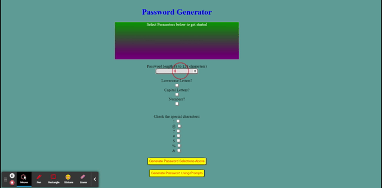

# PasswordGenerator

 

<h3 align="center">PasswordGenerator</h3>

  

    Browser-based application to generate passwords
     
  

  
Table of Contents

  <ol>
    <li>
      <a href="#about-the-project">About The Project</a>
      <ul>
        <li><a href="#tools-used">Tools used</a></li>
      </ul>
    </li>
    <li>
      <a href="#improvements-made">Improvements Made</a>
        </li>
    <li><a href="#license">License</a></li>
    <li><a href="#contact">Contact</a></li>
  </ol>

## About The Project

The goal of this repository is to create a site that will randomly generate a password based on the parameters selected. 

(<a href="#top">back to top</a>)

### Tools used

* JavaScript
* CSS
* HTML

(<a href="#top">back to top</a>)

## Instructions

Once you have navagated to the webpage, 

1. Enter the length of the desired password as a number between 8 and 128.
2. Check the Lowercase Letters, Capital Letter, Numbers, and Special character selections you wish to include
3. Click the "Generate Password Selections Above" button to generate password. You may also Generate a password using the prompt menus if desired.   

(<a href="#top">back to top</a>)

## License

Distributed under the MIT License. See `LICENSE.txt` for more information.

(<a href="#top">back to top</a>)

## Contact

Henry Nguyen -  hln11244@gmail.com

Project Link: [https://github.com/henry11244/PasswordGenerator](https://github.com/henry11244/PasswordGenerator)

(<a href="#top">back to top</a>)

[linkedin-url]: https://www.linkedin.com/in/henry11244/
